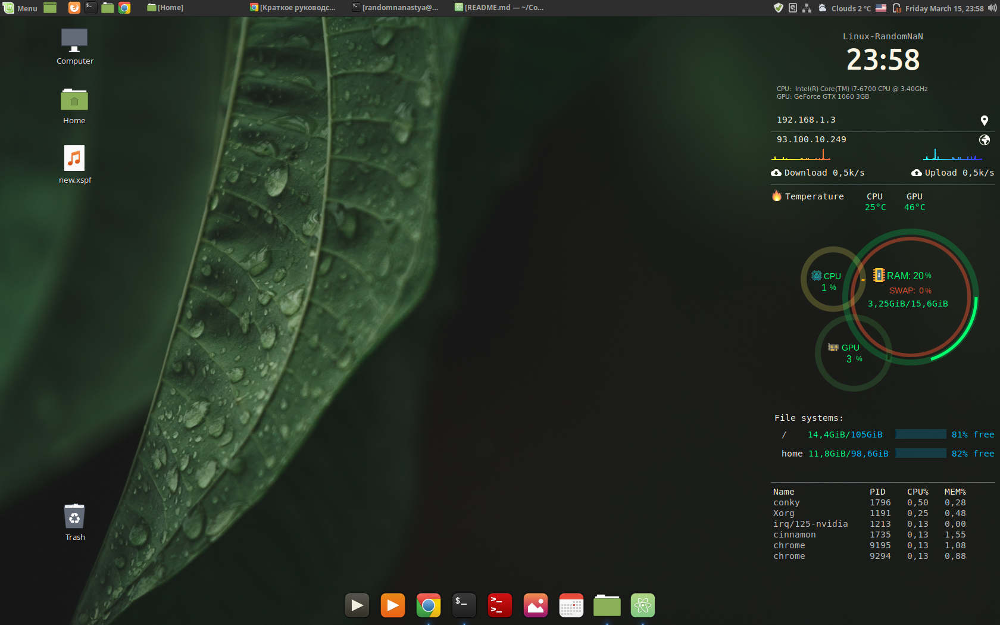
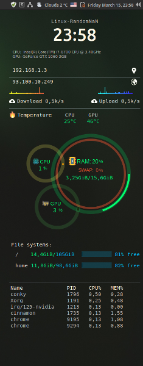

# Custom system monitor Conky
## Applications:
* [Conky repository](https://github.com/brndnmtthws/conky)
* [Conky-draw for ring graph](https://github.com/fisadev/conky-draw)
---
### System requirements
* OS: Linux Mint 19
* Video card: Nvidia

Result





### Installation

1.  copy the repository in the home dirrectory:
```
$ git clone link to repository
```
2. install the app Conky:
```
$ sudo apt-get install conky conky-all
```
### Start the monitor

You may start the app with the command:
```
$ conky
```

Or you may add to autostart. You can add file "conky.desctop" in autostart folder with command:
```
$ cp conky.desctop ~/.config/autostart/
```
And after restart system the app will be on the desctop 
